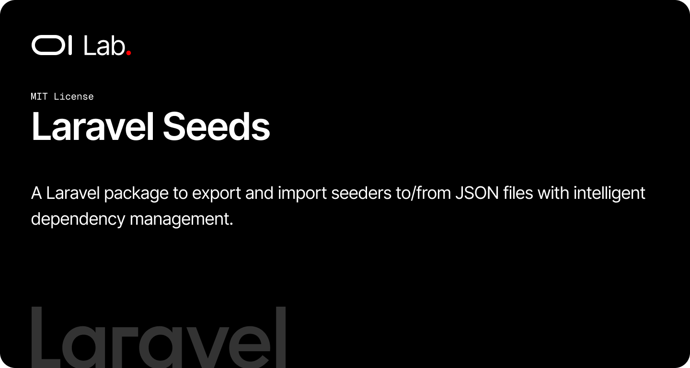

# OI Laravel Seeds

[](https://packagist.org/packages/oi-lab/oi-laravel-seeds)
[](https://packagist.org/packages/oi-lab/oi-laravel-seeds)
[](https://github.com/oi-lab/oi-laravel-seeds/actions)
[](LICENSE)

A Laravel package to export and import seeders to/from JSON files with intelligent dependency management.

## Features

- **JSON Export/Import**: Round-trip database data through portable, version-controllable JSON files
- **Idempotent Imports**: Rows are upserted by a unique key, so re-running never duplicates data
- **Dependency Resolution**: Seeders declare dependencies, ordered automatically via topological sort
- **Relations**: Export models together with their relations using `--with-relations`
- **Multiple Models**: Export/import several models from a single seeder
- **Generator Command**: Scaffold exportable seeders with one artisan command
- **Configurable**: Storage paths, default unique key, auto-discovery, and JSON encoding options

## How It Works

1. **Export**: The package scans your seeders for those using the `ExportableSeeder` trait
2. **Dependencies**: It resolves dependencies using a topological sort to ensure correct order
3. **Export Data**: Each seeder exports its model data to a JSON file in the configured storage path
4. **Import**: When importing, dependencies are processed first, then data is upserted using `updateOrCreate`

## Requirements

- PHP 8.2+
- Laravel 11.0+ or 12.0+

## Installation

Install the package via composer:

```bash
composer require oi-lab/oi-laravel-seeds
```

The package auto-discovers and registers its service provider — no manual registration required.

### Local Development

For local development inside the monorepo, add a path repository to your main project's `composer.json`:

```json
{
    "repositories": [
        {
            "type": "path",
            "url": "./packages/oi-lab/oi-laravel-seeds"
        }
    ]
}
```

### Publish

Publish the configuration file (optional):

```bash
php artisan vendor:publish --tag=oi-laravel-seeds-config
```

Publish the seeder stubs (optional):

```bash
php artisan vendor:publish --tag=oi-laravel-seeds-stubs
```

## Usage

### Creating an Exportable Seeder

Generate a new exportable seeder using the artisan command:

```bash
php artisan make:exportable-seeder GroupSeeder --model=Group --unique-by=name
```

Options:
- `--model` or `-m`: The model class to use for this seeder
- `--unique-by` or `-u`: The unique column(s) for upsert operations (default: id)
- `--json-filename` or `-j`: The JSON filename for export/import

This will create a seeder class like:

```php
<?php

namespace Database\Seeders;

use App\Models\Group;
use Illuminate\Database\Seeder;
use OiLab\OiLaravelSeeds\Traits\ExportableSeeder;

class GroupSeeder extends Seeder
{
    use ExportableSeeder;

    protected string $jsonFilename = 'groups.json';
    protected string $modelClass = Group::class;
    protected array $dependencies = [];
    protected string $uniqueBy = 'name';
    protected array $exportRelations = [];

    public function run(): void
    {
        $this->importData();
    }
}
```

### Defining Dependencies

If your seeder depends on other seeders, specify them in the `$dependencies` property:

```php
protected array $dependencies = [
    UserSeeder::class,
    RoleSeeder::class,
];
```

### Exporting Relations

To export models with their relations, define them in the `$exportRelations` property:

```php
protected array $exportRelations = ['roles', 'permissions'];
```

Then use the `--with-relations` flag when exporting:

```bash
php artisan seed:export --with-relations
```

### Exporting Data

Export all exportable seeders:

```bash
php artisan seed:export
```

Export a specific seeder:

```bash
php artisan seed:export --seeder=GroupSeeder
```

### Importing Data

Import all exportable seeders:

```bash
php artisan seed:import
```

Import a specific seeder:

```bash
php artisan seed:import --seeder=GroupSeeder
```

### Customizing Exported Attributes

Override the `getExportableAttributes` method in your seeder to customize which attributes are exported:

```php
protected function getExportableAttributes(mixed $model): array
{
    $attributes = $model->toArray();

    // Remove sensitive data
    unset($attributes['password'], $attributes['remember_token']);

    return $attributes;
}
```

### Multiple Models per Seeder

You can export/import multiple models in a single seeder by using arrays:

```php
protected array $jsonFilename = ['users.json', 'profiles.json'];
protected array $modelClass = [User::class, Profile::class];
```

### Custom Unique Keys

Use multiple columns for unique constraints:

```php
protected array $uniqueBy = ['email', 'tenant_id'];
```

## Configuration

The configuration file `config/oi-laravel-seeds.php` allows you to customize:

- `storage_path`: Base storage path for JSON files (default: `app/private/seeders`)
- `default_unique_by`: Default column for upsert operations (default: `id`)
- `auto_discover`: Auto-discover exportable seeders (default: `true`)
- `json_options`: JSON encoding options (default: `JSON_PRETTY_PRINT | JSON_UNESCAPED_UNICODE`)

By default, JSON files are stored in `storage/app/private/seeders/`. You can change this:

```php
'storage_path' => env('OI_SEEDS_STORAGE_PATH', 'app/private/seeders'),
```

## AI Assistant Skills

Install Claude Code / JetBrains Junie skill files and a `CLAUDE.md` rules section into your app:

```bash
php artisan oi:skills
```

See [docs/advanced/skills.md](docs/advanced/skills.md) for details.

## Testing

```bash
composer test
```

## Changelog

Please see [CHANGELOG](CHANGELOG.md) for more information on what has changed recently.

## License

The MIT License (MIT). Please see the [License File](LICENSE) for more information.

## Credits

**[Olivier Lacombe](https://www.olacombe.com)** - Creator and maintainer

Olivier is a Product & Technology Director based in Montpellier, France, with over 20 years of experience innovating in UX/UI and emerging technologies. He specializes in guiding enterprises toward cutting-edge digital solutions, combining user-centered design with continuous optimization and artificial intelligence integration.

**Projects & Resources:**
- [OI Dev Docs](https://dev.olacombe.com) - Documentation for all Open Source OI Lab packages
- [OnAI](https://onai.olacombe.com) - Training courses and masterclasses on generative AI for businesses
- [Promptr](https://promptr.olacombe.com) - Prompt engineering Management Platform

## Support

For support, please open an issue on the [GitHub repository](https://github.com/oi-lab/oi-laravel-seeds/issues).
